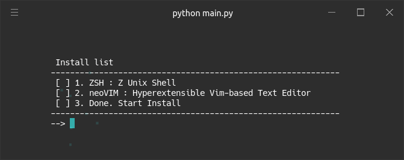
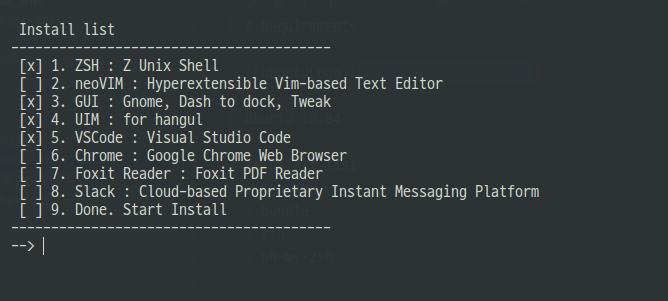

# Execute

## Screenshot

## install list

+ Zsh
+ oh-my-zsh
+ NeoVim
+ Bundle
+ Gnome
+ Dash to Dock
+ Tweak tool
+ UIM
+ VScode
+ Chrome
+ Foxit PDF Reader
+ Slack

## Requirements

+ Ubuntu 18.04 LTS
+ Python 3.6.8